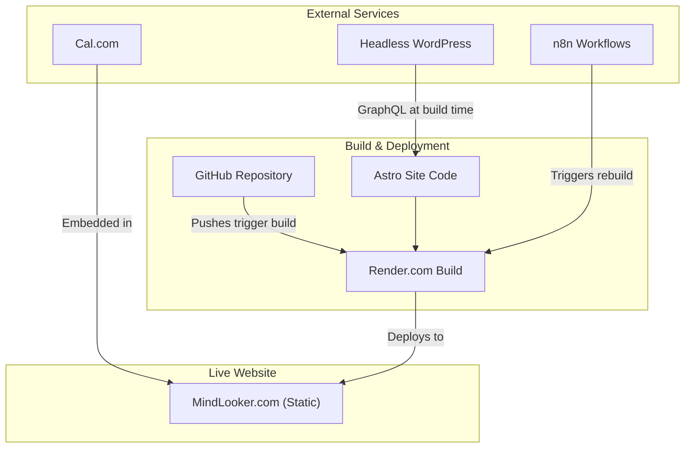

# Technical Planning - MindLooker.com

## 1. Vision
To build a high-performance, SEO-optimized, and scalable static website for MindLooker.com. The site's primary goals are to educate users on the MindLooker 1-on-1 Session, convert visitors into clients for both 1-on-1 sessions and practitioner training, and serve as a content hub for therapy alternatives.

## 2. Technology Stack
The project will use the following modern, performance-focused technologies:
- **Framework:** Astro (Static Site Generator)
- **Styling:** Tailwind CSS
- **CMS (Blog):** Headless WordPress via GraphQL
- **Hosting:** Render.com (Static Site Hosting)
- **Scheduling:** Cal.com
- **Automation:** n8n Workflows
- **Version Control:** Git (on GitHub)

## 3. Architecture & Data Flow



- **Content Flow:** Blog content is written in WordPress. A webhook from WordPress triggers an n8n workflow, which in turn triggers a new build on Render.com. The Astro application fetches the latest posts from the WordPress GraphQL API during this build process.
- **Booking Flow:** The live website embeds booking calendars from Cal.com. Confirmations and follow-ups are handled by Cal.com directly.
- **Development Flow:** All development is done on feature branches in the GitHub repository. Merges to the `main` branch trigger an automatic deployment to production on Render.

## 4. Proposed Project File Structure
This structure organizes the project for clarity, scalability, and maintainability.

```
mindlooker.com/
├── public/
│   ├── assets/
│   │   └── images/
│   ├── favicon.svg
│   └── robots.txt
├── src/
│   ├── components/
│   │   ├── core/
│   │   │   ├── Header.astro
│   │   │   ├── Footer.astro
│   │   │   └── Button.astro
│   │   └── cards/
│   │       ├── TestimonialCard.astro
│   │       └── BlogCard.astro
│   ├── layouts/
│   │   ├── BaseLayout.astro
│   │   └── PostLayout.astro
│   ├── lib/
│   │   └── wordpress.js  # GraphQL queries and client
│   ├── pages/
│   │   ├── index.astro
│   │   ├── about.astro
│   │   ├── sessions.astro
│   │   ├── blog/
│   │   │   ├── index.astro
│   │   │   └── [...slug].astro
│   │   ├── training/
│   │   │   ├── index.astro
│   │   │   └── apply.astro
│   │   └── legal/
│   │       ├── privacy.astro
│   │       ├── terms.astro
│   │       └── disclaimer.astro
│   └── styles/
│       └── global.css
├── astro.config.mjs
├── package.json
└── tailwind.config.js
```

## 5. Page Architecture
- `/`: Homepage - Hero, value proposition, testimonials, CTA for a free session.
- `/about`: About MindLooker - The philosophy, the founder, and the "why."
- `/sessions`: The MindLooker 1-on-1 Session - Detailed explanation of the process, what to expect, and CTAs to book.
- `/blog`: Blog index page.
- `/blog/[slug]`: Individual blog post page.
- `/training`: Practitioner Training - Landing page for the "Maureen" persona, explaining the offer, curriculum overview, and benefits.
- `/training/apply`: Application form/process for the training program.
- `/legal/[page]`: Standard legal pages (Privacy, Terms, Disclaimer).

## 6. Development Workflow
1. **Branching:** Create feature branches from `main` (e.g., `feat/new-training-page`).
2. **Local Development:** Run `npm run dev` to start the local dev server.
3. **Committing:** Use conventional commit messages (e.g., `feat: Add initial training page structure`).
4. **Pull Request:** Open a PR against `main` for code review.
5. **CI/CD:** Upon merging to `main`, Render.com will automatically build and deploy the changes.

## 7. Environment Variables
A `.env` file will be required for local development.
```bash
# .env.example
PUBLIC_SITE_URL="http://localhost:4321"
WORDPRESS_GRAPHQL_ENDPOINT="<your-wordpress-graphql-url>"
CAL_COM_LINK_FREE_TRIAL="<your-cal-com-link>"
CAL_COM_LINK_PAID_SESSION="<your-cal-com-link>"
N8N_WEBHOOK_URL="<your-n8n-form-webhook>"
```

*This document will be the source of truth for all technical planning.*